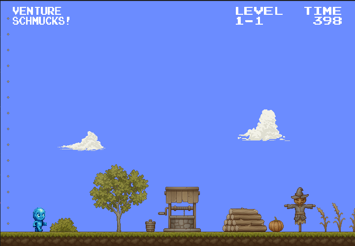

# Screenshots

# Venture

Venture é um jogo de plataforma 2D single-player focado em precisão e reflexos rápidos.
O jogador controla um personagem com a habilidade de alternar entre duas formas elementais — fogo e água — cada uma com características e interações únicas com o cenário.
O objetivo principal é atravessar uma série de níveis desafiadores para encontrar um baú mágico que contém 2 reais.

O jogo combina elementos de ação e lógica, com níveis construídos para explorar ao máximo as diferenças entre as formas do personagem. Cada transformação permite ao jogador acessar novas áreas ou interagir de maneiras distintas com o ambiente, como atravessar corpos d'água ou queimar obstáculos.
A condição de vitória é encontrar o baú no final do jogo, podendo assim comprar 2 paçocas com o dinheiro.
Morte por armadilhas, inimigos ou falhas de execução faz parte constante da experiência, criando um ciclo de tentativa e erro que reforça o tema central do jogo: a superação através da persistência

# Funcionalidades

O jogador pode alternar entre as formas de água e fogo. Na forma de água, o personagem tem a habilidade de realizar um pulo duplo, permitindo alcançar plataformas mais altas. Já na forma de fogo, o personagem pode planar por alguns segundos após um salto, prolongando sua distância no ar. O jogo exige que o jogador combine essas duas habilidades, alternando de forma durante o salto para alcançar locais mais distantes ou superar obstáculos.

### Controles

- Arrow keys: movimento
- Z: troca de forma
- X: lança projétil
- Espaço: pula

# Créditos

Átila: Mecânicas, npcs

Brendo Gético Eugênio: Sprites dos personagens, level design, sons, música, mecânicas de movimentação, ui.

João Pedro Reis Teclo de Miranda: Câmera, mecânicas de movimentação

Gustavo Barros Borba Perdigão: Logo, câmera
